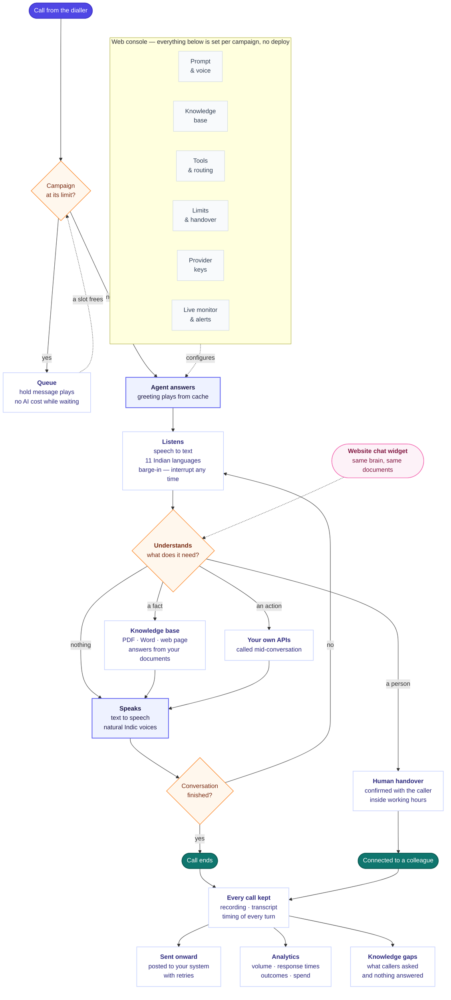
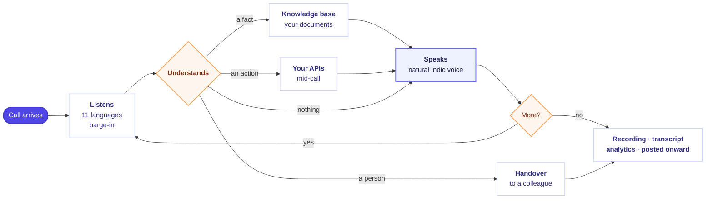

# Feature flowchart

Paste the block below into **[mermaid.live](https://mermaid.live)** and use
*Actions → PNG* or *SVG*. The text comes out perfect because it is text, not a
picture of text — which a flowchart with this many labels will never be from an
image model.



---

## The same thing, wide

For a 16:9 slide, where tall does not fit.



---

## If it has to come from an image model

It will look good and the labels will be wrong. Generate it, then correct every
word in PowerPoint or Figma — or use the Mermaid above and skip that step.

```
Create a clean, modern vertical flowchart illustration for a product slide.
16:9, flat vector, on a very light grey background, with soft shadows and a
restrained palette of white, light indigo and one warm orange accent.

A single flow runs from top to bottom, connected by thin arrows with small
arrowheads:

1. a rounded pill shape at the top, filled solid indigo
2. an orange-outlined diamond, with one arrow leaving its right side into a
   white card, and that card looping back to the diamond
3. a white rounded card
4. a second orange-outlined diamond, with three arrows fanning out to the right
   into three separate white cards stacked vertically, all three rejoining
   the flow below
5. a white rounded card
6. a third orange-outlined diamond, one arrow looping back upward, one
   continuing down
7. a rounded pill shape at the bottom, filled solid teal, with three small
   white cards fanning out beneath it

Every card carries one simple line icon in indigo in its top-left corner:
a soundwave, an open book, two interlocking gears, two human figures, a
circle with a soundwave, a bar chart, a bell.

TEXT — no text anywhere in the image. No letters, no numbers, no labels, no
title, no logo, no watermark. Leave the cards empty apart from their icons, so
that words can be placed on top afterwards.
```
