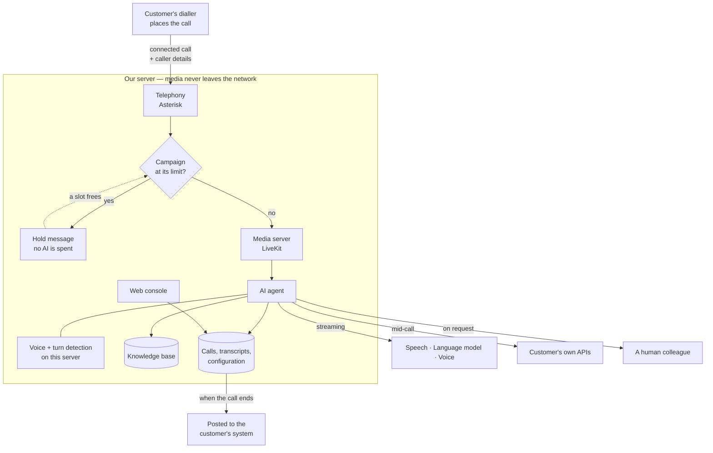
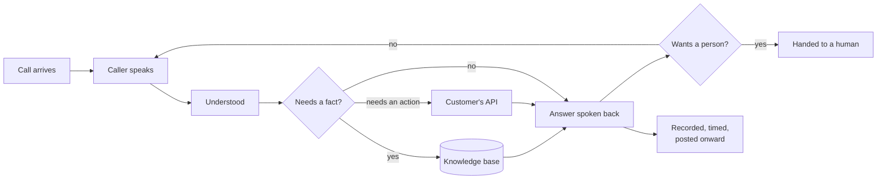

# Prompts for generating diagrams of this system

Paste one of these into ChatGPT (or any image model) to get a picture of what
this platform is and how a call moves through it.

---

## Read this first — what image models can and cannot do

**They cannot spell reliably.** Any picture with more than about eight words in
it will come back with garbled labels: "Knowlege Bse", "Astersik", numbers that
drift. This is not a prompt problem and no amount of "make sure the text is
correct" fixes it.

So the prompts are ordered by how much text they need. Fewer words is not a
lesser picture — it is usually a better one:

| Prompt | Words in the image | Use it for |
|---|---|---|
| **0 — Everything in one** | 0, or 6 | **Start here.** One image for the whole platform |
| **1 — Call journey** | ~10 | A slide showing how a call flows |
| **2 — What it does** | ~14 | A capability overview |
| **3 — Architecture** | ~25 | A technical slide — expect to fix the labels |
| **4 — Cover image** | 0 | A title slide or a header |

**If the labels have to be exactly right, do not use an image model.** Use the
Mermaid diagram at the bottom of this file instead: paste it into
mermaid.live, or into any Markdown that renders Mermaid, and export the SVG.
The text will be perfect because it is text, not a picture of text.

The method that works best: generate a wordless picture from prompt 0, then put
the real words on top of it in PowerPoint, Figma or Canva. It takes five minutes
and it is the difference between a slide that looks made and one that looks
generated.

**Replace the name.** These say "Voice Console". Put the product's real name in
before generating, or leave the name out entirely and add it yourself.

---

## Prompt 0 — everything in one image

The whole platform as a single picture: the journey a call takes, what the agent
can do along the way, and the infrastructure underneath it. This is the one to
use if only one image is wanted.

It carries **no text**, on purpose. That is not a compromise — it is what makes
the difference between a picture that looks bought and a picture that looks
generated. The icons carry the meaning, and any words go on top afterwards in
PowerPoint, Figma or Canva, where they will be spelled correctly and in the
right font. The labels to use are listed further down this file.

```
Create one premium, modern technology illustration for a product landing page.
16:9, highly detailed, flat vector with soft three-dimensional depth.

COMPOSITION — a single sweeping journey from the lower left to the upper right.

At the lower left, a stylised telephone handset outline. A vivid soundwave
leaves it and flows across the whole frame in a smooth S-curve. The wave passes
through four floating glass panels, each tilted slightly in three dimensions and
overlapping the curve. Each panel carries exactly one simple line icon and
nothing else:
  - panel 1: a soundwave inside a circle
  - panel 2: an open book
  - panel 3: a speech bubble
  - panel 4: two human figures side by side

As the wave leaves the fourth panel it resolves into a clean rising line chart
inside a larger frosted dashboard panel at the upper right, with a few small
bars and one upward line.

Underneath the whole curve, faint and low contrast, a horizontal row of small
server racks and database cylinders suggests the infrastructure without pulling
attention. Above the curve, a few small dots connected by thin lines drift like
a light network.

STYLE — deep indigo and violet gradient background. Frosted glass panels with
thin white borders and a soft inner glow. A warm coral accent used sparingly,
only on the soundwave itself. Soft ambient shadows, gentle bloom, generous
empty space in the upper left. Calm, clean, expensive looking. No photographic
elements, no stock-illustration people, no cartoon robots.

TEXT — absolutely no text anywhere in the image. No letters, no numbers, no
labels, no captions, no logo, no watermark. The icons carry the meaning.
```

### The same image with six words in it

If the labels have to be part of the picture rather than added on top. Six is
about the limit before spelling starts to fail, so check every word before
using it.

```
[ Use the whole prompt above, then replace its final TEXT paragraph with this: ]

TEXT — exactly six words appear in the image, one small clean sans-serif label
centred beneath each panel, in light grey, all lowercase:
  - beneath panel 1: "listen"
  - beneath panel 2: "know"
  - beneath panel 3: "answer"
  - beneath panel 4: "handover"
  - beneath the telephone at the lower left: "call"
  - beneath the dashboard panel at the upper right: "measure"
No other text of any kind. No title, no caption, no logo, no watermark. Spell
each word exactly as written.
```

### If the first result is not right

These three changes fix most of what comes back wrong, one at a time:

- **Too busy** — remove the drifting network of dots, and the server row.
- **Too flat** — ask for "stronger depth of field, the front panel in sharp
  focus and the back panels softly blurred".
- **Wrong mood** — swap "deep indigo and violet" for "near-black charcoal with
  a single electric blue accent" for something more serious, or "soft cream and
  warm sand with a deep teal accent" for something friendlier.

---

## Prompt 1 — The call journey

For explaining, in one picture, what happens when a call comes in. The fewest
words, so the best chance of a clean result.

```
Create a clean, modern horizontal flow diagram for a business slide, 16:9,
on a very light grey background.

Six rounded rectangular cards in a single row, connected left to right by thin
arrows. Each card has a simple line icon above a one or two word label. Use a
restrained palette: white cards, soft grey borders, a single indigo accent for
the icons and arrows. Flat vector illustration style, generous white space,
subtle drop shadows. No gradients, no 3D, no clutter.

The six cards, in order:
1. icon: a telephone — label: "Call"
2. icon: a soundwave — label: "Listen"
3. icon: a document with a magnifier — label: "Look up"
4. icon: a speech bubble — label: "Answer"
5. icon: two people — label: "Handover"
6. icon: a bar chart — label: "Report"

Only those six words appear in the image. No other text, no title, no legend,
no watermark. Keep every label short and spelled exactly as written.
```

---

## Prompt 2 — What it does

A capability overview, for a page that says "here is what the platform gives
you" without describing the plumbing.

```
Create a modern flat-vector infographic for a product slide, 16:9, light
background, arranged as a 3x2 grid of six square cards with rounded corners.

Each card holds one large simple line icon in indigo, with a short label
underneath in dark grey. White cards, soft shadow, plenty of space between
them. Corporate but friendly. No gradients, no photographs, no 3D.

The six cards:
1. a microphone with soundwaves — "Real-time voice"
2. an open book — "Knowledge base"
3. a globe with speech marks — "Indian languages"
4. two arrows between a robot and a person — "Human handover"
5. a sliding control panel — "Per campaign"
6. a line graph going up — "Live analytics"

Only those twelve words appear. No headings, no paragraphs, no watermark,
no logo. Spell each label exactly as written.
```

---

## Prompt 3 — The architecture

More text than an image model handles well. Generate it, then expect to correct
the labels by hand — or use the Mermaid version below instead.

```
Create a clean technical architecture diagram for an engineering slide, 16:9,
white background, flat vector style with thin lines and a restrained palette
of white, grey and one indigo accent.

Three horizontal bands stacked vertically, each a rounded rectangle with a thin
border and a short label on its left edge.

TOP BAND, labelled "Dialler": a single box, "Outbound calls".
An arrow points down from it into the middle band.

MIDDLE BAND, labelled "Our server": four boxes in a row, connected by short
arrows — "Telephony", "Media server", "AI agent", "Console". Below this row,
one wide box spanning underneath them, labelled "Database".

BOTTOM BAND, labelled "Cloud": three small boxes in a row — "Speech", "Language
model", "Voice". A dashed arrow points up from this band to the "AI agent" box.

Simple line icons may sit above each box label. No other text anywhere in the
image. Keep the words short and spelled exactly as written above.
```

---

## Prompt 4 — Cover image, no text at all

The safest thing an image model can make, because there is nothing to misspell.
Good for a title slide with your own text on top.

```
Create a wide 16:9 abstract header illustration for a technology product,
flat vector style, on an off-white background.

A stylised soundwave flows from left to right across the frame and gradually
transforms into a smooth data line that rises gently. A simple telephone
handset outline sits at the far left, and a small abstract network of connected
dots sits at the far right.

Indigo and soft grey only, with a lot of empty space in the upper half so text
can be placed there later. Minimal, calm, corporate. No text, no letters, no
numbers, no logo, no watermark anywhere in the image.
```

---

## The words, if you want to label a picture yourself

Written out so a slide can be captioned accurately, whatever the picture ends
up looking like.

**What it is, in one sentence**

> An AI voice agent that answers calls in Hindi and other Indian languages,
> looks up answers in the customer's own documents, calls their own systems
> mid-conversation, and hands over to a person when it should.

**How a call actually moves**

1. The customer's existing dialler places the call and waits for a person to
   answer.
2. The connected call is handed to this platform, along with who the caller is
   and what they own.
3. The campaign's limit is checked. Over it, the caller hears a hold message and
   is connected the moment a slot frees — no AI is spent while waiting.
4. The agent joins and starts talking. Voice detection and turn detection run on
   the server itself, so the caller can interrupt mid-sentence.
5. Speech becomes text, the language model answers, the answer becomes speech —
   all streaming, all overlapping.
6. Product questions are looked up in the knowledge base rather than answered
   from memory.
7. The customer's own APIs are called mid-call when the conversation needs them.
8. The caller can ask for a person and be transferred, or the agent ends the
   call itself when the conversation is done.
9. The recording, the transcript and every timing are stored, and the finished
   call is posted to the customer's system.

**What the console does**

- Calls list, and every call with its transcript, recording, per-turn timings
  and which documents were used
- Dashboard — volume, response times, outcomes, token and character usage
- Live monitor of calls in progress
- Alerts on provider failures, latency, and calls that stop arriving
- Knowledge gaps — the questions callers asked that nothing answered
- Per campaign: prompt, voice and model, knowledge base, tools, routing, keys,
  limits and handoff, postback, a chat tester, and prompt history
- Multi-client: separate clients, users and roles, with provider keys held per
  client and encrypted
- An embeddable chat widget for a website, on the same campaign and knowledge base

**Numbers, all measured on this deployment — check them before publishing**

- ~0.75 s of ring before the agent is ready
- ~2.4 s from the call arriving to the first spoken word
- 20 concurrent calls run clean
- 11 Indian languages
- Media never leaves the local network; only AI requests go out

---

## The accurate version — Mermaid, not an image model

For anything where the labels have to be right. Paste into
[mermaid.live](https://mermaid.live) and export SVG or PNG.



Same thing as a single left-to-right journey, for a wider slide:


